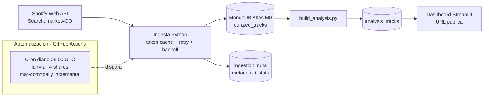

# Spotify Electrónica Colombia

[](https://github.com/luisangelquezada88-netizen/spotify-electronica-colombia/actions/workflows/ci.yml)
[](https://github.com/luisangelquezada88-netizen/spotify-electronica-colombia/actions/workflows/ingestion.yml)

**Live demo:** https://spotify-electronica-colombia.streamlit.app

*Nota*: Si la app se encuentra dormida por inactividad, presiona `Yes, get this app back up!`

Pipeline ELT end-to-end para recolectar, almacenar, transformar y visualizar
metadatos de música electrónica asociada al mercado colombiano, usando la
Spotify Web API como fuente y MongoDB como capa de aterrizaje.
Automatizado con GitHub Actions y desplegado a **costo cero**
(MongoDB Atlas M0 + Streamlit Community Cloud).

## Arquitectura de datos



Flujo detallado en [`architecture/pipeline-flow.mmd`](architecture/pipeline-flow.mmd)
y diagrama general en [`architecture/general-architecture.mmd`](architecture/general-architecture.mmd).
Decisiones de diseño: [`docs/architecture.md`](docs/architecture.md) ·
fuente: [`docs/data-source.md`](docs/data-source.md) ·
metodología: [`docs/methodology.md`](docs/methodology.md).

Capas en MongoDB:

| Colección | Contenido |
|---|---|
| `curated_tracks` | Tracks aplanados y deduplicados (índice único `spotify_track_id`) |
| `analysis_tracks` | Dataset derivado para el dashboard (año, duración, contadores) |
| `ingestion_runs` | Metadata por corrida: modo, queries, requests, `popularity_stats`, errores |

## Opción A — Ver el dashboard (sin instalar nada)

Abre https://spotify-electronica-colombia.streamlit.app en cualquier navegador.
No requiere login. Si la app estuvo inactiva varios días, la primera carga
tarda 30–60 s (política del tier gratuito).

## Opción B — Correr el dashboard en local

```powershell
pip install -r requirements.txt
# .env con MONGO_URI y MONGO_DB_NAME (ver .env.example)
streamlit run src/dashboard_app.py
```

## Opción C — Pipeline completo con Docker

```powershell
cp .env.example .env   # completa SPOTIFY_CLIENT_ID/SECRET y MONGO_URI
docker build -t spotify-etl .
# Smoke test: 2 queries recientes
docker run --rm --env-file .env spotify-etl python run_ingestion.py --mode daily --limit-queries 2
# Corrida diaria real + rebuild analítico
docker run --rm --env-file .env spotify-etl python run_ingestion.py --mode daily
docker run --rm --env-file .env spotify-etl python scripts/build_analysis.py
```

## CLI de ingesta

```powershell
python run_ingestion.py --mode daily                    # refresh años recientes
python run_ingestion.py --mode full                     # matriz completa
python run_ingestion.py --mode full --min-popularity 20 # con umbral de popularidad
python run_ingestion.py --mode daily --limit-queries 2  # smoke test
python scripts/backfill_popularity.py --dry-run         # hidratar popularity faltante
python scripts/inspect_curated.py                       # ver un documento de ejemplo
```

## Automatización y despliegue

- **Scheduling:** GitHub Actions, cron diario 05:00 UTC (lunes = full en
  4 shards paralelos, resto = daily incremental) + disparo manual.
  Detalle: [`docs/automation.md`](docs/automation.md).
- **Base de datos:** MongoDB Atlas M0 (tier gratuito permanente).
- **Dashboard:** Streamlit Community Cloud (URL pública).
  Paso a paso: [`docs/deployment.md`](docs/deployment.md).
- **Operación:** [`docs/runbook.md`](docs/runbook.md) (429, 401, backfill, rollback).

Secretos requeridos (`Settings → Secrets → Actions` y Secrets de Streamlit):

| Secreto | Origen |
|---|---|
| `SPOTIFY_CLIENT_ID` / `SPOTIFY_CLIENT_SECRET` | [Spotify Developer Dashboard](https://developer.spotify.com/dashboard) |
| `MONGO_URI` / `MONGO_DB_NAME` | MongoDB Atlas (cluster M0) |

## Límites conocidos

- La app de Spotify rechaza `limit > 10` en search (`400 Invalid limit`,
  verificado 2026-09-15): `config/settings.yaml` fija `limit: 10`.
- Spotify aplica rate limits agresivos en Development Mode: el pipeline usa
  parada temprana de paginación, backoff con `Retry-After` topado y aborto
  con progreso parcial (`status: quota_exhausted`) ante baneos largos.
- `popularity` puede llegar nulo desde la API para parte del catálogo;
  se hidrata con `scripts/backfill_popularity.py`.

## Estructura

```text
├── .github/workflows/      # ingestion.yml (diaria + semanal) y ci.yml
├── architecture/           # diagramas .mmd del pipeline
├── config/settings.yaml    # queries, paginación, min_popularity, recent_years
├── docs/                   # arquitectura, fuente, metodología, automation, deployment, runbook
│   └── images/pipeline.png # diagrama exportado del pipeline
├── scripts/                # build_analysis, backfill_popularity, inspect_curated
├── src/                    # auth, search, ingestion, transform, mongo, dashboard_app
├── tests/diagnostics/      # checks manuales de conexión, conteos y agregaciones
├── Dockerfile
└── run_ingestion.py        # entrypoint CLI
```
