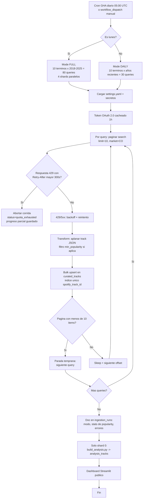

# Flujo del pipeline ELT

> Fuente viva de este diagrama. El archivo anterior `pipeline-flow.mmd`
> (texto plano, GitHub no lo renderizaba) fue reemplazado por este `.md`.

## Reglas verificadas contra la API (2026-09)

- `limit=10` máximo aceptado (`>10` da `400 Invalid limit`).
- `offset` máximo útil 1000; la parada temprana evita paginar en vacío.
- `popularity` llega nulo en search y `/v1/tracks` da `403`: el filtro por
  umbral está implementado pero inactivo (`min_popularity: 0`).
  Detalle en `docs/data-source.md` §19.
